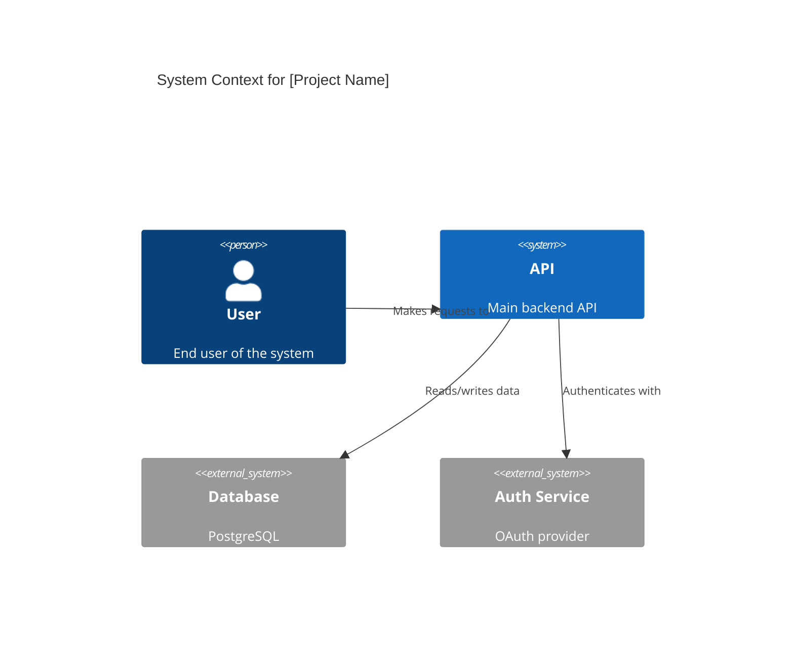
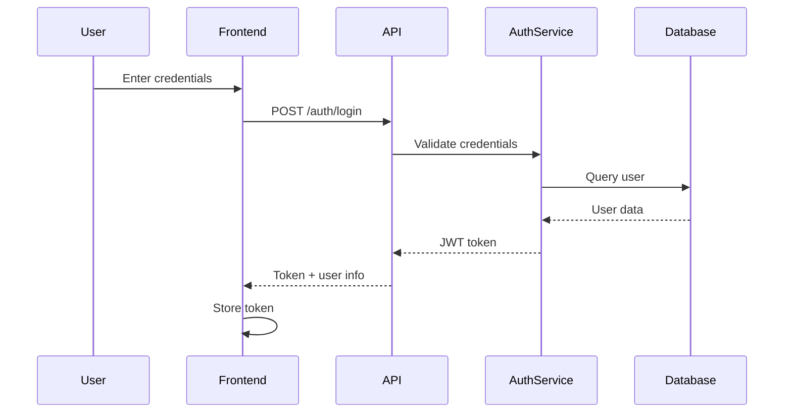
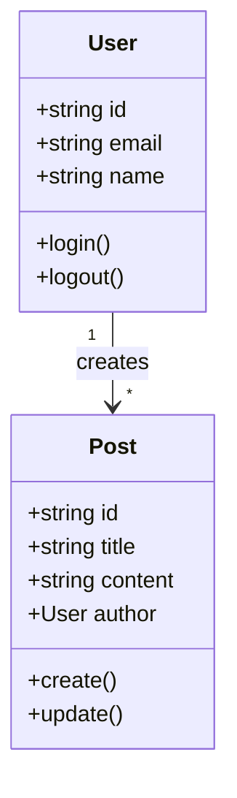
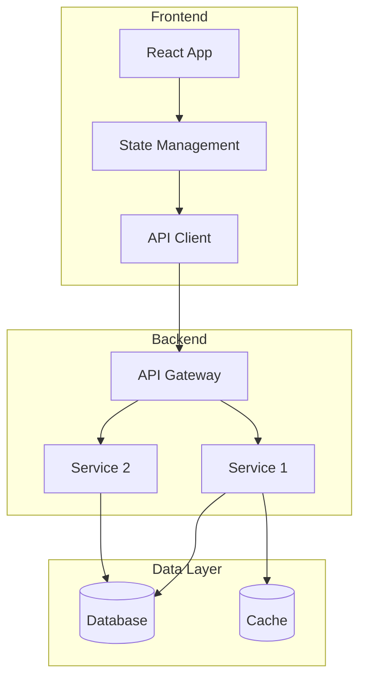
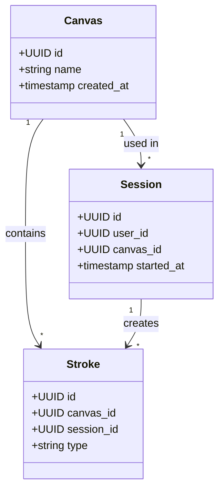
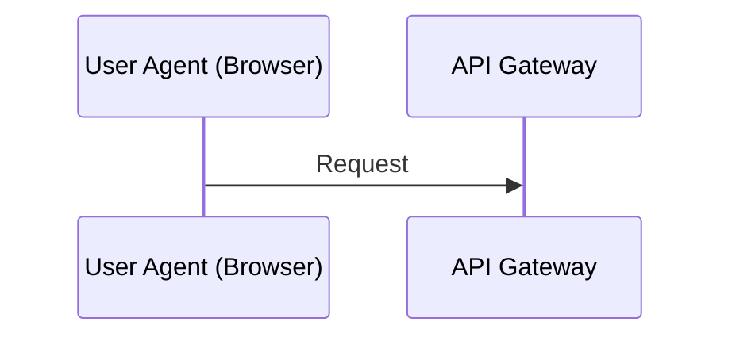
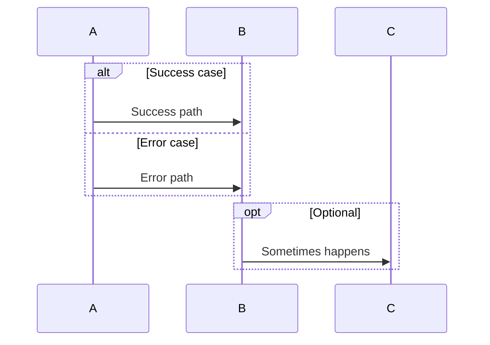
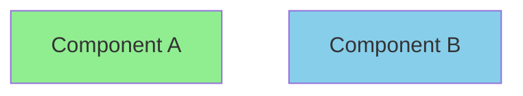
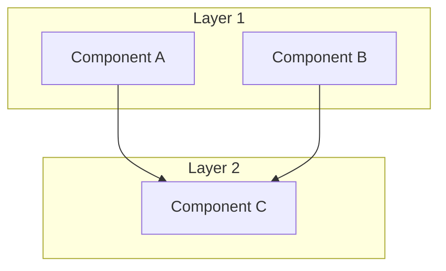

# Mermaid Diagram Generation Prompts

Quick reference for generating new Mermaid diagrams for this project.

---

## Component/Container Diagram (C4 Style)

**Prompt**:
```
Generate a Mermaid C4 diagram showing the system architecture.

Use this format:


Include:
- All external systems and actors
- Primary application components
- Key relationships and data flows
- Technology choices as descriptions

Output ONLY the Mermaid code, properly formatted.
```

---

## Sequence Diagram for Specific Flow

**Prompt**:
```
Generate a Mermaid sequence diagram for [specific feature, e.g., "user login flow"].

Trace through these files: [list key files]

Use this format:


Include:
- All components in the flow
- Success path first
- Error/alternative paths as notes
- Database queries
- External API calls

Output ONLY the Mermaid code.
```

---

## Class Diagram (for key domain models)

**Prompt**:
```
Create a Mermaid class diagram showing the key domain models and their relationships.

Focus on: [specific module/feature]

Use this format:


Include:
- Key properties (public/important ones)
- Main methods
- Relationships (composition, aggregation, inheritance)
- Multiplicities

Output ONLY the Mermaid code.
```

---

## System Architecture Overview

**Prompt**:
```
Create a high-level Mermaid architecture diagram showing:


Show:
- Major architectural layers
- Service boundaries
- Data stores
- External dependencies
- Clear flow direction

Output ONLY the Mermaid code with subgraphs for logical grouping.
```

---

## Example Usage

### Generate Drawing Collaboration Flow

**User Request**:
> Generate a Mermaid sequence diagram for "real-time drawing collaboration flow".
> 
> Trace through these files:
> - components/Canvas.tsx (pointer events, drawing)
> - hooks/useRealtime.ts (broadcasting, subscriptions)
> - app/api/stroke/route.ts (saving strokes)

**Expected Output**: `sequences/realtime-drawing-collaboration.mmd` content

---

### Generate New Entity Relationships

**User Request**:
> Create a Mermaid class diagram for the Canvas entity and its relationships if we add multi-canvas support.
> 
> Include:
> - Canvas entity (id, name, created_at)
> - Relationship with Sessions (which canvas was used)
> - Relationship with Strokes (which canvas they belong to)

**Expected Output**:


---

## Tips for Better Diagrams

1. **Start Simple**: Begin with major components, add details incrementally
2. **Use Subgraphs**: Group related components for clarity
3. **Label Relationships**: Always label arrows with meaningful verbs
4. **Include Technology**: Add tech stack info in descriptions
5. **Show Data Flow**: Use arrow direction to show data movement
6. **Alternative Paths**: Use `alt/else` in sequence diagrams for error handling
7. **Notes for Context**: Add notes to explain complex interactions
8. **Consistent Naming**: Match component names to actual code files/classes

---

## Diagram Testing Checklist

Before committing new diagrams:
- [ ] Syntax is valid (renders without errors)
- [ ] All referenced components exist in codebase
- [ ] Relationships accurately reflect implementation
- [ ] Labels are clear and meaningful
- [ ] Styling is consistent with existing diagrams
- [ ] README.md updated with new diagram info

---

## Common Mermaid Syntax Patterns

### Participants with Long Names


### Conditional Logic in Sequences


### Styling Nodes


### Subgraphs in Graphs


---

## Automated Diagram Generation Ideas

### Future Improvements

1. **Code-to-Diagram Tools**:
   - Parse TypeScript interfaces → Generate class diagrams
   - Trace function calls → Generate sequence diagrams
   - Analyze imports → Generate component dependency graphs

2. **Validation Tools**:
   - Script to verify all diagram participants exist in codebase
   - Automated broken link detection
   - Mermaid syntax validator in CI

3. **Living Diagrams**:
   - Auto-update on code changes
   - Git hooks to remind about diagram updates
   - Diagram coverage metrics

---

## Resources

- **Mermaid Documentation**: https://mermaid.js.org/
- **C4 Model Guide**: https://c4model.com/
- **Sequence Diagram Guide**: https://mermaid.js.org/syntax/sequenceDiagram.html
- **Class Diagram Guide**: https://mermaid.js.org/syntax/classDiagram.html
- **Mermaid Live Editor**: https://mermaid.live/
