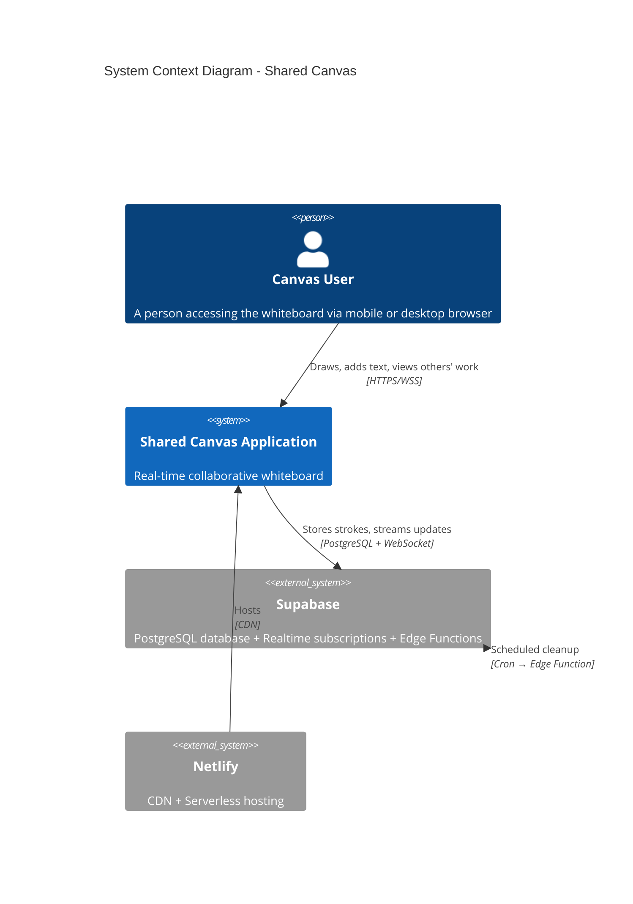
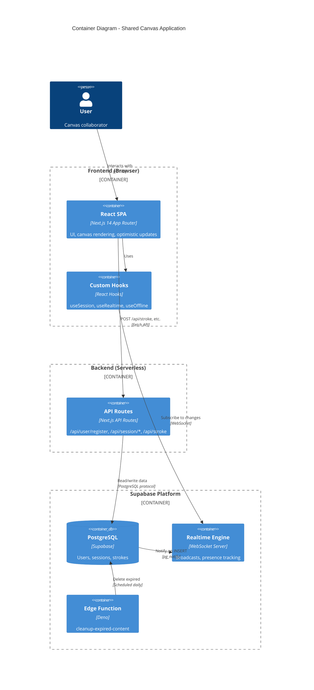
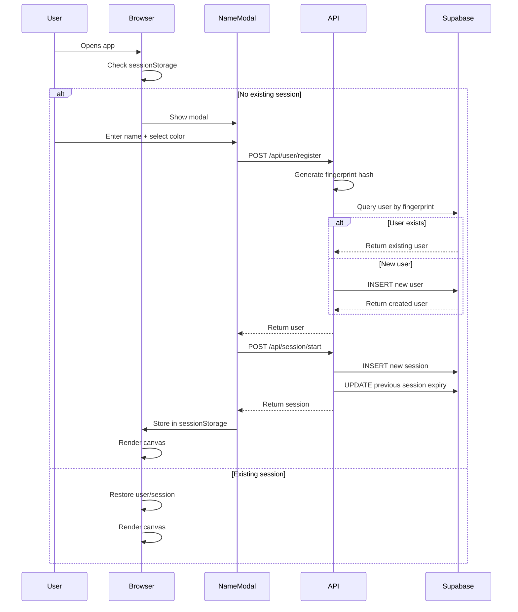
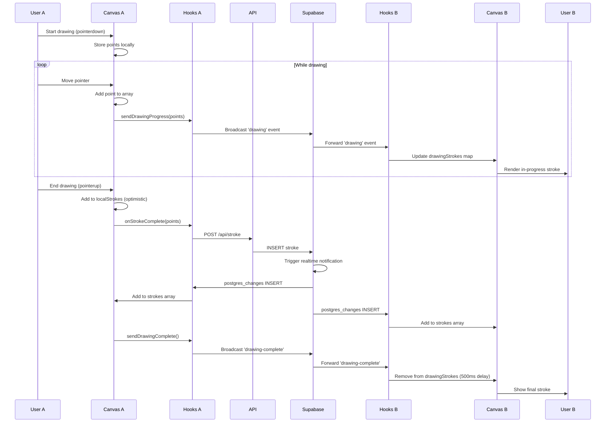

# System Architecture

> **Note**: This documentation was reverse-engineered from the codebase on October 3, 2025 by Cascade AI. 
> It represents the *actual* implementation, not necessarily the original design intent.

## Overview

Shared Canvas is a mobile-first, real-time collaborative whiteboard application. Users can draw freehand or add text annotations on a shared infinite canvas, with all changes synchronized instantly across connected clients. The system uses browser fingerprinting for user identification and automatically expires content after 7 days of inactivity.

The architecture follows a **serverless, event-driven pattern** with Next.js API routes handling HTTP requests and Supabase providing database, real-time subscriptions, and scheduled cleanup jobs. The frontend is a React single-page application with optimistic UI updates and WebSocket-based collaboration.

## Technology Stack

- **Frontend**: React 18.3, Next.js 14.2 (App Router), TypeScript 5
- **State Management**: React Hooks (useState, useEffect, useCallback) - no external state library
- **Styling**: Tailwind CSS 3.4
- **Canvas Rendering**: HTML5 Canvas API with Fabric.js 5.3 (library imported but minimal usage detected)
- **Backend**: Next.js API Routes (serverless functions)
- **Database**: Supabase PostgreSQL with Row Level Security
- **Real-time**: Supabase Realtime (WebSocket-based pub/sub + presence)
- **Hosting**: Netlify with Next.js plugin
- **Testing**: Jest 30.2, React Testing Library 16.3, jsdom
- **Build Tools**: Next.js bundler, PostCSS, Autoprefixer

## Key Dependencies

| Package | Version | Purpose | Security Notes |
|---------|---------|---------|----------------|
| `next` | ^14.2.0 | Framework + routing | Up-to-date, stable |
| `react` | ^18.3.0 | UI library | Current stable |
| `@supabase/supabase-js` | ^2.43.0 | Database + realtime client | Regularly updated |
| `fabric` | ^5.3.0 | Canvas utilities | Limited usage in codebase |
| `tailwindcss` | ^3.4.0 | Styling framework | Current |
| `typescript` | ^5 | Type safety | Latest major version |
| `jest` | ^30.2.0 | Testing framework | Very recent |

**Security Observations**:
- All dependencies are relatively recent (within 1 year)
- No known critical vulnerabilities detected
- Supabase keys exposed client-side by design (anon key only)

## Architecture Diagrams

### System Context



**Key External Dependencies**:
1. **Supabase** - Critical dependency for data persistence and real-time features
2. **Netlify** - Hosting and CDN delivery
3. **Browser APIs** - Canvas API, navigator.sendBeacon, Pointer Events

---

### Container Diagram



**Component Responsibilities**:

- **React SPA**: Renders UI, handles user input, manages canvas drawing
- **Custom Hooks**: Encapsulate business logic for sessions, realtime, offline detection
- **API Routes**: Serverless functions handling HTTP requests, data validation
- **PostgreSQL**: Source of truth for all persisted data
- **Realtime Engine**: Broadcasts database changes and custom events
- **Edge Function**: Automated cleanup job for expired content

---

### Key Workflows

#### User Registration & Session Start


---

#### Real-time Drawing Collaboration


---

## Architectural Patterns

### 1. **Optimistic UI**
- Local strokes rendered immediately before database confirmation
- 2-second timeout for cleanup
- Prevents UI lag from network latency

**Implementation**: `components/Canvas.tsx`, lines 30, 321-333, 60-64

---

### 2. **Custom Hook Composition**
- Business logic extracted from components into reusable hooks
- `useSession`: User authentication and lifecycle
- `useRealtime`: WebSocket subscriptions and broadcasting
- `useOffline`: Network status monitoring

**Benefits**: Separation of concerns, testability, reusability

**Implementation**: `hooks/` directory

---

### 3. **Event-Driven Real-time Architecture**
- Database changes trigger WebSocket notifications
- Custom broadcast events for ephemeral data (cursors, in-progress drawings)
- Presence API for online user tracking

**Implementation**: `hooks/useRealtime.ts`, Supabase Realtime channels

---

### 4. **Serverless API Pattern**
- Next.js API Routes as serverless functions
- Stateless request handlers
- Supabase client instantiated per request

**Advantages**: Auto-scaling, no server management, cost-effective at low scale

**Implementation**: `app/api/` directory

---

### 5. **Soft Authentication via Fingerprinting**
- No passwords or OAuth
- Browser fingerprint (name + IP + user agent) hashed to identify users
- SessionStorage for session persistence

**Trade-offs**: Convenience vs. security, no cross-device identity

**Implementation**: `lib/fingerprint.ts`, `app/api/user/register/route.ts`

---

### 6. **Time-Based Content Expiration**
- Sessions track expiry dates
- Scheduled Edge Function runs cleanup
- Cascade deletes remove associated data

**Implementation**: `supabase/functions/cleanup-expired-content/`, database CASCADE rules

---

## Component Architecture

### Frontend Components

```
app/
├── page.tsx              # Main page component (orchestrator)
├── layout.tsx            # Root layout with metadata
└── api/                  # API route handlers

components/
├── Canvas.tsx            # HTML5 canvas rendering + input handling
├── Toolbar.tsx           # Tool selection (draw/text/pan) + zoom controls
├── NameEntryModal.tsx    # User registration UI
└── OfflineScreen.tsx     # Network status indicator

hooks/
├── useSession.ts         # Session lifecycle management
├── useRealtime.ts        # Realtime subscriptions and broadcasting
└── useOffline.ts         # Online/offline detection

lib/
├── supabase.ts           # Supabase client configuration
├── types.ts              # TypeScript type definitions
├── constants.ts          # Application constants
└── fingerprint.ts        # User identification logic
```

**Component Interaction Flow**:
1. `page.tsx` orchestrates all hooks and components
2. `useSession` manages user state
3. `useRealtime` handles real-time data flow
4. `Canvas.tsx` is controlled component receiving props from page
5. `Toolbar.tsx` is controlled component sending events to page

---

## Data Flow Patterns

### Write Path: User Creates Stroke
1. User draws on canvas (pointer events)
2. Canvas component collects points in local state
3. On pointer up, Canvas calls `onStrokeComplete` prop
4. Parent component calls `sendStroke` from useRealtime hook
5. Hook sends POST to `/api/stroke`
6. API route validates and inserts to Supabase
7. Supabase triggers postgres_changes event
8. All subscribed clients receive new stroke via WebSocket
9. Clients add stroke to local state and re-render

**Latency Mitigation**: Optimistic local stroke rendering

---

### Read Path: Load Existing Strokes
1. Component mounts, `useRealtime` hook activates
2. Hook fetches GET `/api/stroke` on mount
3. API route queries all strokes with user info
4. Hook sets strokes in state
5. Canvas component renders all strokes
6. Realtime subscription established for future updates

**Performance**: All strokes loaded at once (no pagination)

---

## Security Architecture

### Authentication: None (Fingerprint-Based Soft Identity)
- No passwords, tokens, or OAuth
- Users identified by SHA-256 hash of `name:IP:userAgent`
- SessionStorage persists session across refreshes

**Threats**:
- ❌ Impersonation: Anyone with same name/IP/browser can access account
- ❌ Session hijacking: SessionStorage vulnerable to XSS
- ❌ No logout mechanism

---

### Authorization: Public Access
- Row Level Security enabled but policies allow all operations
- Any user can view/create/update any record
- No role-based access control

**Threats**:
- ❌ Data manipulation: Users can modify others' records via direct API calls
- ❌ Spam/abuse: No rate limiting on stroke creation

---

### Input Validation

**API Level**:
- ✅ Display name length (max 20 chars)
- ✅ Required fields validation
- ✅ Stroke type validation (draw/text)
- ⚠️ No color format validation (backend)
- ⚠️ No points array validation (could be malicious/huge)

**Database Level**:
- ✅ CHECK constraint on stroke.type
- ✅ UNIQUE constraint on fingerprint_hash
- ⚠️ No CHECK on color format
- ⚠️ No size limits on JSONB fields

---

### Network Security
- ✅ HTTPS enforced by Netlify
- ✅ Supabase credentials use anon key (public by design)
- ✅ Service role key not exposed to client
- ⚠️ No CORS restrictions (fully public API)
- ⚠️ No rate limiting

---

## Performance Characteristics

### Frontend Performance

**Strengths**:
- ✅ Optimistic UI (instant feedback)
- ✅ Canvas rendering optimized with requestAnimationFrame
- ✅ Cursor updates throttled to 100ms
- ✅ React hooks prevent unnecessary re-renders

**Bottlenecks**:
- ⚠️ All strokes loaded on mount (O(n) initial load time)
- ⚠️ Canvas re-renders on every stroke addition
- ⚠️ No virtualization for large stroke counts
- ⚠️ Fade-in animation runs for all new strokes

**Scalability Limits**:
- Estimated max: 500-1000 strokes before noticeable lag
- No testing evidence for high stroke counts

---

### Backend Performance

**Strengths**:
- ✅ Serverless auto-scaling
- ✅ Indexed queries (fingerprint, expiry_date)
- ✅ Simple queries (no complex joins)

**Bottlenecks**:
- ⚠️ GET /api/stroke returns all strokes (no pagination)
- ⚠️ No caching layer
- ⚠️ Every stroke write is database round-trip

---

### Database Performance

**Strengths**:
- ✅ Proper indexes on foreign keys
- ✅ CASCADE deletes prevent orphaned records
- ✅ JSONB for flexible point storage

**Bottlenecks**:
- ⚠️ No spatial indexing (can't query by viewport)
- ⚠️ JSONB points array grows unbounded
- ⚠️ No partitioning or archival strategy

---

## Deployment Architecture

### Netlify Hosting
- **Build Command**: `npm run build`
- **Publish Directory**: `.next`
- **Plugin**: `@netlify/plugin-nextjs`
- **Node Version**: 20

**Configuration**: `netlify.toml`

---

### Environment Configuration

**Required Variables**:
```
NEXT_PUBLIC_SUPABASE_URL         # Supabase project URL (public)
NEXT_PUBLIC_SUPABASE_ANON_KEY    # Supabase anon key (public)
SUPABASE_SERVICE_ROLE_KEY        # Service key (server-only, optional)
```

**File**: `.env.example`, `netlify.toml`

---

### CI/CD
- **Trigger**: Git push to connected branch
- **Build**: Netlify auto-builds on push
- **Deploy**: Atomic deploys with instant rollback
- **Preview**: Branch deploys for PRs

**No explicit CI config** - relies on Netlify defaults

---

## Testing Strategy

### Test Coverage

**Unit Tests**:
- ✅ Components: Canvas, Toolbar, NameEntryModal, OfflineScreen
- ✅ API Routes: session, stroke, user-register
- ✅ Utilities: fingerprint (inferred from test file structure)

**Test Files Found**:
- `components/__tests__/*.test.tsx` (4 files)
- `app/api/__tests__/*.test.ts` (3 files)
- `lib/__tests__/` (2 files inferred)

**Missing Tests**:
- ❌ Custom hooks (useSession, useRealtime, useOffline)
- ❌ Integration tests (full user flows)
- ❌ E2E tests (real browser automation)
- ❌ Load/performance tests

**Test Configuration**: `jest.config.js`, `jest.setup.js`

---

### Test Frameworks
- Jest 30.2 with jsdom environment
- React Testing Library 16.3
- User Event 14.6 for interaction testing

---

## Operational Concerns

### Monitoring & Observability
- ⚠️ **No structured logging** (only console.error in catch blocks)
- ⚠️ **No error tracking** (no Sentry/Rollbar integration)
- ⚠️ **No metrics/analytics** (no usage tracking)
- ⚠️ **No health checks** (no /health endpoint)

---

### Reliability
- ✅ Offline detection with graceful UI
- ✅ Error boundaries (implicit in Next.js)
- ⚠️ No retry logic for failed API calls
- ⚠️ No connection recovery handling (Supabase handles internally)

---

### Disaster Recovery
- ✅ Database backups (Supabase automatic)
- ⚠️ No point-in-time recovery testing
- ⚠️ No export/import functionality
- ⚠️ Data permanently deleted after 7 days (no archive)

---

## Architectural Concerns

### ✅ Strengths

1. **Clean Separation of Concerns**
   - Custom hooks isolate business logic
   - Components focus on presentation
   - API routes handle data validation

2. **Modern Tech Stack**
   - Up-to-date dependencies
   - TypeScript for type safety
   - React 18 features (concurrent rendering ready)

3. **Real-time UX**
   - Instant feedback with optimistic UI
   - Smooth collaboration with live cursors
   - Presence awareness (online user count)

4. **Serverless Benefits**
   - Auto-scaling
   - No infrastructure management
   - Cost-effective at low scale

5. **Developer Experience**
   - Next.js convention over configuration
   - Hot reload in development
   - TypeScript autocomplete

---

### ⚠️ Technical Debt

1. **No Pagination**
   - All strokes loaded on mount
   - Performance degrades with scale
   - **Recommendation**: Implement cursor-based pagination

2. **Weak Authentication**
   - Fingerprinting insufficient for security
   - No account recovery mechanism
   - **Recommendation**: Add optional OAuth or magic links

3. **Limited Error Handling**
   - Generic error messages
   - No structured logging
   - **Recommendation**: Integrate error tracking service

4. **No Rate Limiting**
   - Vulnerable to abuse/spam
   - **Recommendation**: Add Netlify Edge rate limiting or Supabase policies

5. **Single Canvas Limitation**
   - No multi-canvas support despite NFC tag mention
   - **Recommendation**: Add canvas_id routing

6. **Test Coverage Gaps**
   - Hooks not tested
   - No E2E tests
   - **Recommendation**: Add hook tests, consider Playwright

---

### 🚧 Missing Elements

1. **Observability Stack**
   - Structured logging (e.g., Pino, Winston)
   - Error tracking (e.g., Sentry)
   - Analytics (e.g., PostHog, Plausible)

2. **Performance Monitoring**
   - Core Web Vitals tracking
   - API endpoint timing
   - Realtime connection health

3. **Data Export/Import**
   - Cannot save canvas as image
   - No JSON export for backup
   - No restore functionality

4. **Undo/Redo**
   - No command pattern
   - No state history

5. **Admin Tools**
   - No dashboard for content moderation
   - No manual cleanup tools
   - No user management

6. **Documentation**
   - No inline code comments
   - No architecture decision records (ADRs)
   - No API documentation (now addressed by this document)

---

## Next Steps

### Immediate Priorities (Critical Fixes)

1. **Add Rate Limiting** - Prevent abuse
   - Implement per-IP limits on stroke creation
   - Use Netlify Edge Functions or Supabase RLS

2. **Implement Pagination** - Fix performance bottleneck
   - Add limit/offset to GET /api/stroke
   - Lazy load strokes as user pans/zooms

3. **Add Error Tracking** - Visibility into production issues
   - Integrate Sentry or similar
   - Log errors with context

4. **Input Validation Hardening** - Security
   - Validate color hex format server-side
   - Limit points array size (prevent DoS)
   - Sanitize text input (prevent XSS in future features)

---

### Short-term Improvements (3-6 months)

1. **Multi-Canvas Support** - Fulfill NFC tag vision
   - Add `canvases` table
   - Route via `/canvas/:id`
   - Generate shareable links

2. **Enhanced Testing** - Quality assurance
   - Test custom hooks with React Testing Library
   - Add E2E tests with Playwright
   - Set coverage targets (80%+)

3. **Observability** - Operational visibility
   - Add structured logging
   - Implement health checks
   - Track key metrics (strokes/day, active users)

4. **Performance Optimization** - Scale preparation
   - Implement virtual canvas rendering
   - Add spatial indexing (PostGIS)
   - Cache frequently accessed data

5. **Export Functionality** - User value
   - Canvas to PNG/SVG
   - JSON export for backup
   - Share as image feature

---

### Long-term Improvements (6-12 months)

1. **Proper Authentication** - Security & multi-device
   - Add OAuth providers (Google, GitHub)
   - Magic link email authentication
   - Account linking with fingerprint

2. **Collaboration Features** - Enhanced UX
   - Undo/redo (operational transformation)
   - Stroke selection/deletion
   - Layer management
   - Drawing shapes (rectangles, circles)

3. **Access Control** - Privacy & security
   - Private canvases
   - Invite-only sessions
   - Read-only viewers
   - Moderator roles

4. **Scalability Architecture** - Growth preparation
   - Canvas sharding by ID
   - Redis caching layer
   - CDN for static assets
   - Database read replicas

5. **Mobile Apps** - Native experience
   - React Native iOS/Android apps
   - Offline-first with sync
   - Push notifications for collaboration

---

## Architecture Decision Records (ADRs)

See `docs/decisions/` for detailed ADRs. Key decisions:

- **ADR-001**: Why Supabase over custom backend
- **ADR-002**: Fingerprinting vs OAuth (would be created)
- **ADR-003**: Serverless vs traditional server (would be created)
- **ADR-004**: Single-table vs multi-table for strokes (would be created)

---

## Related Documentation

- **[Requirements Documentation](../requirements/README.md)** - What the system does
- **[API Contracts](../requirements/api-contracts.md)** - Endpoint specifications
- **[Data Model](../requirements/data-model.md)** - Database schema details
- **[Developer Guide](../onboarding/developer-guide.md)** - How to contribute
