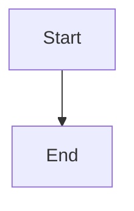
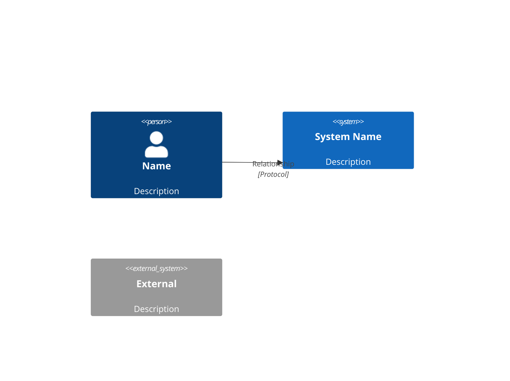
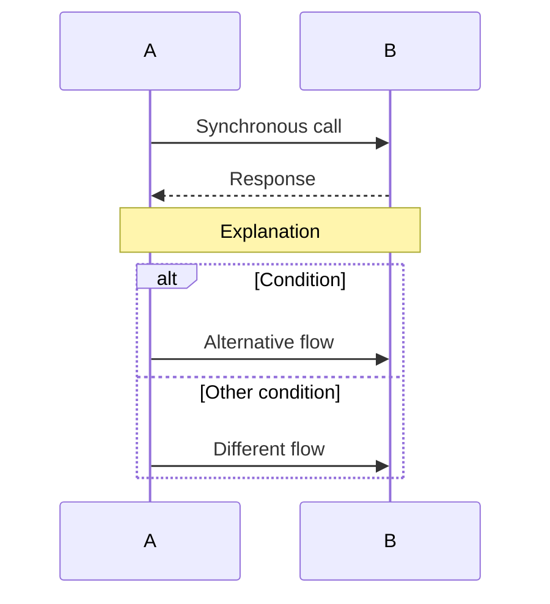
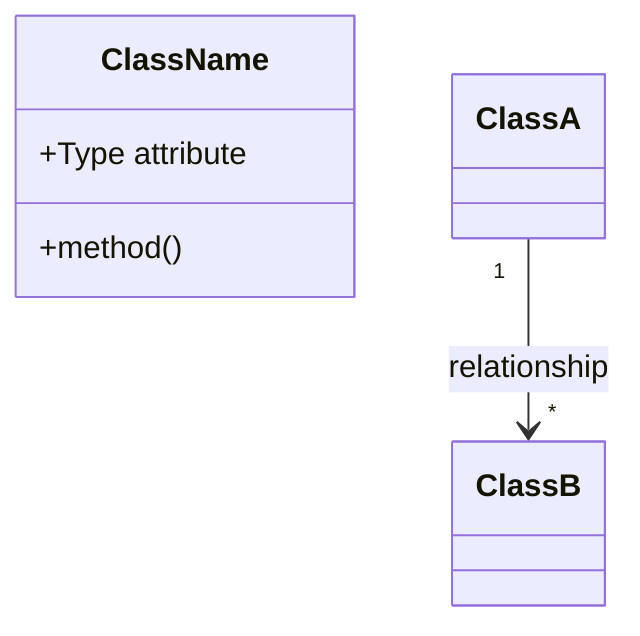
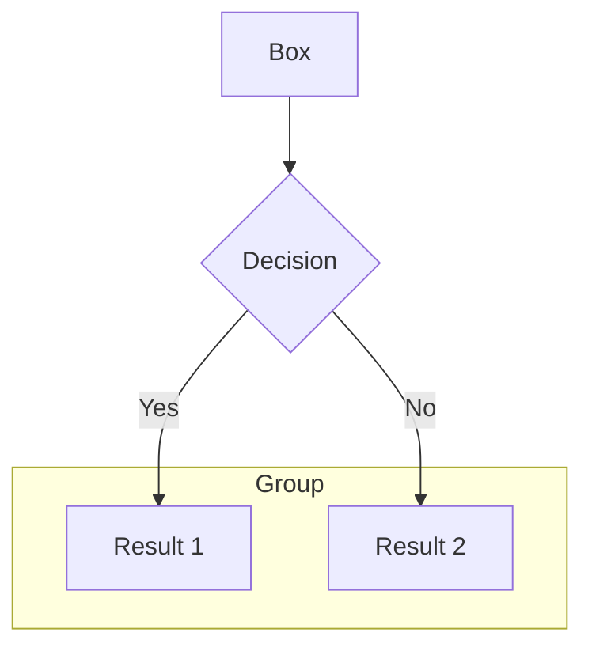

# Architecture Diagrams

This directory contains all Mermaid diagram source files for the Shared Canvas application.

---

## 📁 Directory Structure

```
diagrams/
├── system-context.mmd              # C4 Context diagram
├── containers.mmd                  # C4 Container diagram
├── system-architecture.mmd         # High-level system architecture
├── component-interaction.mmd       # Component relationships
├── data-model.mmd                  # Entity-Relationship diagram
└── sequences/                      # Sequence diagrams for workflows
    ├── user-registration-session-start.mmd
    ├── realtime-drawing-collaboration.mmd
    └── session-lifecycle.mmd
```

---

## 📊 Diagram Catalog

### 1. System Context Diagram
**File**: `system-context.mmd`  
**Type**: C4 Context  
**Purpose**: Shows the Shared Canvas system in its environment with external actors and systems

**Key Elements**:
- Canvas User (person)
- Shared Canvas Application (system)
- Supabase (external system)
- Netlify (external system)

**Best For**: Explaining the system to non-technical stakeholders

---

### 2. Container Diagram
**File**: `containers.mmd`  
**Type**: C4 Container  
**Purpose**: Breaks down the application into major containers (deployable units)

**Key Elements**:
- Frontend: React SPA + Custom Hooks
- Backend: Next.js API Routes
- Supabase: PostgreSQL + Realtime + Edge Function

**Best For**: Understanding deployment architecture and technology choices

---

### 3. System Architecture Overview
**File**: `system-architecture.mmd`  
**Type**: Graph (layered)  
**Purpose**: High-level view of architectural layers and data flow

**Key Elements**:
- Browser layer (React, Hooks, Components)
- Netlify Edge (API Routes)
- Supabase Cloud (Database, Realtime, Functions)

**Best For**: Quick architectural overview, onboarding slides

---

### 4. Component Interaction Diagram
**File**: `component-interaction.mmd`  
**Type**: Graph (flow)  
**Purpose**: Shows how React components, hooks, and APIs interact

**Key Elements**:
- Main Page orchestrator
- Custom hooks (useSession, useRealtime, useOffline)
- UI components (Canvas, Toolbar, Modal)
- API layer connections

**Best For**: Frontend developers understanding component relationships

---

### 5. Data Model Diagram
**File**: `data-model.mmd`  
**Type**: Class Diagram  
**Purpose**: Visualizes database entities and relationships

**Key Elements**:
- User entity (fingerprint-based identity)
- Session entity (lifecycle management)
- Stroke entity (canvas content)
- Relationships and cardinalities

**Best For**: Database design discussions, understanding data flow

---

### 6. User Registration & Session Start Sequence
**File**: `sequences/user-registration-session-start.mmd`  
**Type**: Sequence Diagram  
**Purpose**: Traces the user onboarding flow from first visit to canvas access

**Key Steps**:
1. Check sessionStorage
2. Show name entry modal (if needed)
3. Generate fingerprint and register user
4. Start new session
5. Store in sessionStorage

**Best For**: Understanding authentication flow and session persistence

---

### 7. Real-time Drawing Collaboration Sequence
**File**: `sequences/realtime-drawing-collaboration.mmd`  
**Type**: Sequence Diagram  
**Purpose**: Shows how drawing strokes are synchronized between users in real-time

**Key Steps**:
1. User A starts drawing
2. In-progress strokes broadcast to User B
3. Drawing completes, saves to database
4. Database INSERT triggers realtime notification
5. Both users see final stroke

**Best For**: Understanding optimistic UI and real-time sync mechanisms

---

### 8. Session Lifecycle Sequence
**File**: `sequences/session-lifecycle.mmd`  
**Type**: Sequence Diagram  
**Purpose**: Documents complete session lifecycle from start to cleanup

**Key Phases**:
1. **Session Start**: Registration or restoration from storage
2. **Active Session**: User interactions and stroke creation
3. **Session End**: Tab close triggers cleanup
4. **Content Expiration**: Scheduled cleanup after 7 days

**Best For**: Understanding session management and content expiration logic

---

## 🎨 Rendering Diagrams

### In GitHub/GitLab

GitHub and GitLab automatically render Mermaid diagrams in Markdown files:

```markdown

```

### In VS Code

Install the **Mermaid Preview** extension:
1. Open VS Code Extensions (Cmd+Shift+X)
2. Search for "Mermaid Preview"
3. Install by Mermaid-js
4. Right-click `.mmd` file → "Preview Mermaid Diagram"

### In Documentation Sites

#### MkDocs
Add to `mkdocs.yml`:
```yaml
markdown_extensions:
  - pymdownx.superfences:
      custom_fences:
        - name: mermaid
          class: mermaid
          format: !!python/name:pymdownx.superfences.fence_code_format
```

#### Docusaurus
Mermaid support built-in:
```javascript
// docusaurus.config.js
module.exports = {
  themes: ['@docusaurus/theme-mermaid'],
  markdown: {
    mermaid: true,
  },
};
```

### Export as Images

#### Using Mermaid CLI
```bash
npm install -g @mermaid-js/mermaid-cli
mmdc -i system-context.mmd -o system-context.png
```

#### Using Online Editor
1. Go to https://mermaid.live/
2. Paste diagram code
3. Click "Actions" → "PNG/SVG/PDF"

---

## 📝 Diagram Maintenance

### When to Update Diagrams

| Change Type | Diagrams to Update |
|-------------|-------------------|
| New external service | `system-context.mmd` |
| New deployable component | `containers.mmd`, `system-architecture.mmd` |
| New React component/hook | `component-interaction.mmd` |
| Database schema change | `data-model.mmd` |
| New user workflow | Add new sequence diagram |
| API endpoint added/changed | Update relevant sequence diagrams |

### Diagram Versioning

- Diagrams are versioned with code (Git)
- Each diagram reflects current implementation
- Archive old diagrams if major refactoring occurs
- Name archived diagrams: `system-context-v1-archived.mmd`

### Review Checklist

Before merging diagram changes:
- [ ] Diagram syntax is valid (preview renders correctly)
- [ ] All entities/components referenced still exist in code
- [ ] Labels and descriptions are accurate
- [ ] Colors/styling consistent with other diagrams
- [ ] Related documentation updated

---

## 🎓 Mermaid Syntax Quick Reference

### C4 Diagrams


### Sequence Diagrams


### Class Diagrams


### Graph/Flow Diagrams


---

## 📚 Additional Resources

- **Mermaid Official Docs**: https://mermaid.js.org/
- **C4 Model**: https://c4model.com/
- **Mermaid Live Editor**: https://mermaid.live/
- **Mermaid Cheat Sheet**: https://jojozhuang.github.io/tutorial/mermaid-cheat-sheet/

---

**Last Updated**: October 4, 2025  
**Maintainer**: Development Team
